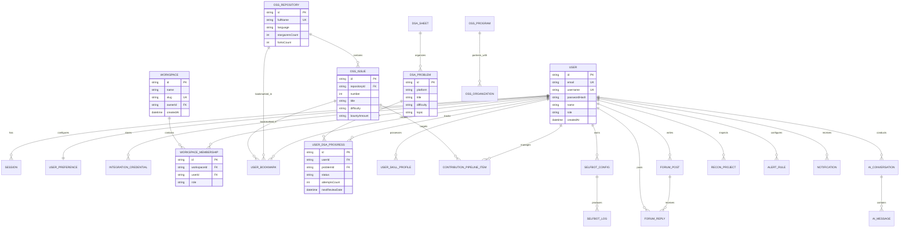

# DevOrbit — Database Entity Relationship (ER) Diagram

---

## 1. High-Level Entity-Relationship Model

```mermaid
erDiagram
    USER ||--o{ SESSION : has
    USER ||--|| USER_PREFERENCE : configures
    USER ||--o{ INTEGRATION_CREDENTIAL : stores
    USER ||--o{ WORKSPACE_MEMBERSHIP : belongs_to
    WORKSPACE ||--o{ WORKSPACE_MEMBERSHIP : contains
    
    USER ||--o{ USER_BOOKMARK : creates
    USER ||--o{ USER_DSA_PROGRESS : tracks
    DSA_PROBLEM ||--o{ USER_DSA_PROGRESS : records
    DSA_SHEET ||--o{ DSA_PROBLEM : organizes
    
    OSS_REPOSITORY ||--o{ OSS_ISSUE : contains
    OSS_REPOSITORY ||--o{ USER_BOOKMARK : bookmarked_in
    OSS_ISSUE ||--o{ USER_BOOKMARK : bookmarked_in
    OSS_PROGRAM ||--o{ OSS_ORGANIZATION : partners_with
    
    USER ||--o{ USER_SKILL_PROFILE : possesses
    USER ||--o{ CONTRIBUTION_PIPELINE_ITEM : manages
    OSS_ISSUE ||--o{ CONTRIBUTION_PIPELINE_ITEM : targets
    
    USER ||--o{ SELFBOT_CONFIG : owns
    SELFBOT_CONFIG ||--o{ SELFBOT_LOG : produces
    
    USER ||--o{ FORUM_POST : writes
    FORUM_POST ||--o{ FORUM_REPLY : receives
    USER ||--o{ FORUM_REPLY : posts
    
    USER ||--o{ AI_CONVERSATION : conducts
    AI_CONVERSATION ||--o{ AI_MESSAGE : contains
    
    USER ||--o{ RECON_PROJECT : inspects
    USER ||--o{ ALERT_RULE : configures
    USER ||--o{ NOTIFICATION : receives

    USER {
        string id PK
        string email UK
        string username UK
        string passwordHash
        string name
        string role
        datetime createdAt
    }

    WORKSPACE {
        string id PK
        string name
        string slug UK
        string ownerId FK
        datetime createdAt
    }

    WORKSPACE_MEMBERSHIP {
        string id PK
        string workspaceId FK
        string userId FK
        string role
    }

    DSA_PROBLEM {
        string id PK
        string platform
        string title
        string difficulty
        string topic
    }

    USER_DSA_PROGRESS {
        string id PK
        string userId FK
        string problemId FK
        string status
        int attemptsCount
        datetime nextReviewDate
    }

    OSS_REPOSITORY {
        string id PK
        string fullName UK
        string language
        int stargazersCount
        int forksCount
    }

    OSS_ISSUE {
        string id PK
        string repositoryId FK
        int number
        string title
        string difficulty
        string bountyAmount
    }
```
